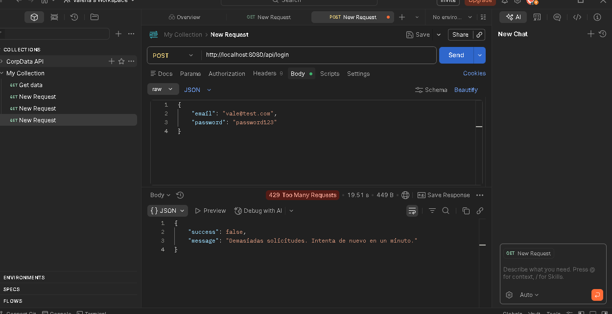
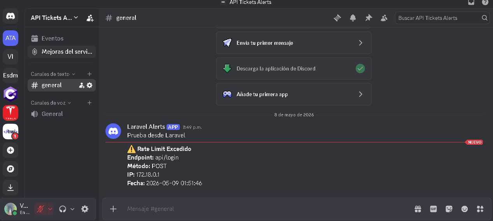
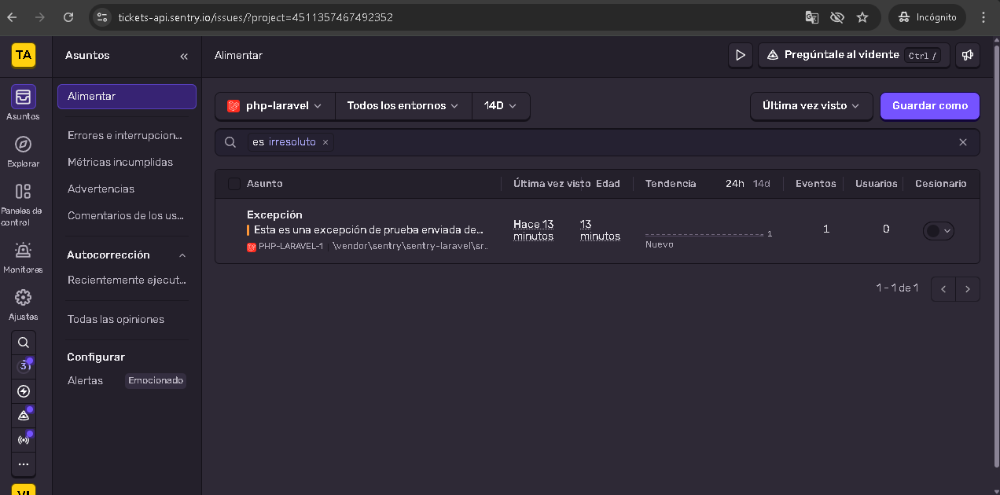
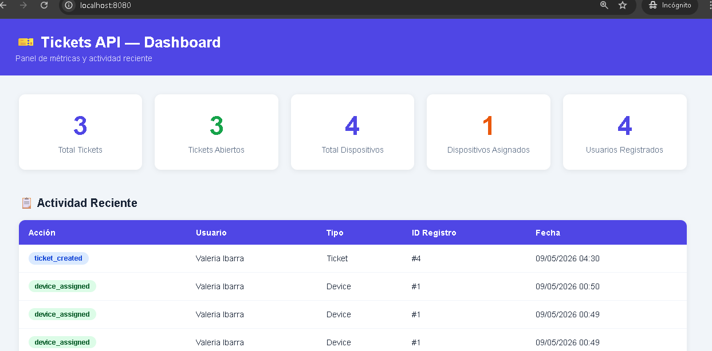

# Tickets API — Laravel REST API

API REST desarrollada con Laravel para la gestión de tickets de soporte técnico, asignación de dispositivos y control de incidencias dentro de una organización.

---

## Tabla de Contenidos

- [Tecnologías](#tecnologías)
- [Requisitos Previos](#requisitos-previos)
- [Instalación](#instalación)
- [Variables de Entorno](#variables-de-entorno)
- [Instrucciones Docker](#instrucciones-docker)
- [Endpoints](#endpoints)
- [Autenticación](#autenticación)
- [Rate Limiting](#rate-limiting)
- [Discord Webhooks](#discord-webhooks)
- [Sentry](#sentry)
- [Evidencias](#evidencias)

---

## Tecnologías

- PHP 8.4
- Laravel 11
- SQL Server 2022
- Laravel Sanctum (autenticación)
- Docker + Docker Compose
- Sentry (monitoreo de errores)
- Discord Webhooks (notificaciones)

---

## Requisitos Previos

- PHP 8.2+
- Composer
- Docker Desktop
- SQL Server (o usar el contenedor incluido)

---

## Instalación

### Sin Docker

```bash
# 1. Clonar el repositorio
git clone <url-del-repo>
cd tickets-api

# 2. Instalar dependencias
composer install

# 3. Copiar variables de entorno
cp .env.example .env

# 4. Generar clave de aplicación
php artisan key:generate

# 5. Ejecutar migraciones
php artisan migrate

# 6. Iniciar servidor
php artisan serve --port=8080
```

### Con Docker

Ver sección [Instrucciones Docker](#instrucciones-docker).

---

## Variables de Entorno

Crea un archivo `.env` basado en `.env.example` con las siguientes variables:

```env
APP_NAME=TicketsAPI
APP_ENV=local
APP_KEY=
APP_DEBUG=true
APP_URL=http://localhost:8080

# Base de datos SQL Server
DB_CONNECTION=sqlsrv
DB_HOST=sqlserver
DB_PORT=1433
DB_DATABASE=tickets_db
DB_USERNAME=sa
DB_PASSWORD=TicketsAPI@2026

# Sentry
SENTRY_LARAVEL_DSN=https://xxxxx@xxxxx.ingest.sentry.io/xxxxx

# Discord
DISCORD_WEBHOOK_URL=https://discord.com/api/webhooks/xxxxx/xxxxx
```

---

## Instrucciones Docker

### Levantar los contenedores

```bash
docker-compose up -d --build
```

### Verificar contenedores activos

```bash
docker-compose ps
```

### Ejecutar migraciones dentro del contenedor

```bash
docker exec -it tickets_app php artisan migrate
```

### Ver logs

```bash
docker-compose logs -f
```

### Detener contenedores

```bash
docker-compose down
```

### Servicios incluidos

| Servicio | Puerto | Descripción |
|----------|--------|-------------|
| `app` | — | Laravel PHP-FPM |
| `nginx` | `8080` | Servidor web |
| `sqlserver` | `1433` | Base de datos SQL Server |

---

## Endpoints

### Públicos

| Método | Endpoint | Descripción |
|--------|----------|-------------|
| `POST` | `/api/register` | Registrar usuario |
| `POST` | `/api/login` | Iniciar sesión |

### Protegidos (requieren Bearer Token)

| Método | Endpoint | Descripción |
|--------|----------|-------------|
| `POST` | `/api/logout` | Cerrar sesión |
| `GET` | `/api/tickets` | Obtener todos los tickets |
| `GET` | `/api/tickets/{id}` | Obtener ticket por ID |
| `POST` | `/api/tickets` | Crear ticket |
| `PUT` | `/api/tickets/{id}` | Actualizar ticket |
| `DELETE` | `/api/tickets/{id}` | Eliminar ticket |
| `GET` | `/api/devices` | Consultar dispositivos |
| `POST` | `/api/devices/assign` | Asignar dispositivo |

---

## Autenticación

La API usa **Laravel Sanctum** para autenticación mediante tokens Bearer.

### Registro

```http
POST /api/register
Content-Type: application/json

{
    "name": "Valeria Ibarra",
    "email": "valeria@test.com",
    "password": "password123"
}
```

### Login

```http
POST /api/login
Content-Type: application/json

{
    "email": "valeria@test.com",
    "password": "password123"
}
```

### Usar el token

En cada request protegido incluir el header:

```
Authorization: Bearer <token>
```

---

## Rate Limiting

Todos los endpoints están protegidos con Rate Limiting de Laravel.

- **Límite:** 10 requests por minuto por IP/usuario
- **Código de respuesta:** `429 Too Many Requests`

```json
{
    "success": false,
    "message": "Demasiadas solicitudes. Intenta de nuevo en un minuto."
}
```

### Evidencia Rate Limiting



---

## Discord Webhooks

El sistema envía notificaciones automáticas a Discord en dos escenarios:

### Error 500
Cuando ocurre una excepción interna se notifica con:
- Mensaje del error
- Archivo donde ocurrió
- Fecha y hora

### Rate Limit Excedido
Cuando un usuario supera el límite se notifica con:
- Endpoint afectado
- Método HTTP
- IP del cliente
- Fecha y hora

### Evidencia Discord



---

## Sentry

El proyecto integra **Sentry** para monitoreo y trazabilidad de errores en producción.

### Configuración

Agregar el DSN en el `.env`:

```env
SENTRY_LARAVEL_DSN=https://xxxxx@xxxxx.ingest.sentry.io/xxxxx
```

### Probar integración

```bash
php artisan sentry:test
```

### Evidencia Sentry



---

## Colección Postman

Importa la colección para probar todos los endpoints fácilmente.

### Pasos para importar

1. Abre Postman
2. Clic en **Import**
3. Pega esta colección JSON:

```json
{
  "info": {
    "name": "Tickets API",
    "schema": "https://schema.getpostman.com/json/collection/v2.1.0/collection.json"
  },
  "item": [
    {
      "name": "Register",
      "request": {
        "method": "POST",
        "url": "http://localhost:8080/api/register",
        "header": [{ "key": "Content-Type", "value": "application/json" }],
        "body": {
          "mode": "raw",
          "raw": "{\"name\": \"Valeria Ibarra\", \"email\": \"valeria@test.com\", \"password\": \"password123\"}"
        }
      }
    },
    {
      "name": "Login",
      "request": {
        "method": "POST",
        "url": "http://localhost:8080/api/login",
        "header": [{ "key": "Content-Type", "value": "application/json" }],
        "body": {
          "mode": "raw",
          "raw": "{\"email\": \"valeria@test.com\", \"password\": \"password123\"}"
        }
      }
    },
    {
      "name": "Get Tickets",
      "request": {
        "method": "GET",
        "url": "http://localhost:8080/api/tickets",
        "header": [{ "key": "Authorization", "value": "Bearer {{token}}" }]
      }
    },
    {
      "name": "Create Ticket",
      "request": {
        "method": "POST",
        "url": "http://localhost:8080/api/tickets",
        "header": [
          { "key": "Authorization", "value": "Bearer {{token}}" },
          { "key": "Content-Type", "value": "application/json" }
        ],
        "body": {
          "mode": "raw",
          "raw": "{\"title\": \"Laptop no enciende\", \"description\": \"La laptop del área de contabilidad no enciende\", \"priority\": \"high\", \"device_type\": \"laptop\"}"
        }
      }
    },
    {
      "name": "Get Ticket by ID",
      "request": {
        "method": "GET",
        "url": "http://localhost:8080/api/tickets/1",
        "header": [{ "key": "Authorization", "value": "Bearer {{token}}" }]
      }
    },
    {
      "name": "Update Ticket",
      "request": {
        "method": "PUT",
        "url": "http://localhost:8080/api/tickets/1",
        "header": [
          { "key": "Authorization", "value": "Bearer {{token}}" },
          { "key": "Content-Type", "value": "application/json" }
        ],
        "body": {
          "mode": "raw",
          "raw": "{\"status\": \"in_progress\"}"
        }
      }
    },
    {
      "name": "Delete Ticket",
      "request": {
        "method": "DELETE",
        "url": "http://localhost:8080/api/tickets/1",
        "header": [{ "key": "Authorization", "value": "Bearer {{token}}" }]
      }
    },
    {
      "name": "Get Devices",
      "request": {
        "method": "GET",
        "url": "http://localhost:8080/api/devices",
        "header": [{ "key": "Authorization", "value": "Bearer {{token}}" }]
      }
    },
    {
      "name": "Assign Device",
      "request": {
        "method": "POST",
        "url": "http://localhost:8080/api/devices/assign",
        "header": [
          { "key": "Authorization", "value": "Bearer {{token}}" },
          { "key": "Content-Type", "value": "application/json" }
        ],
        "body": {
          "mode": "raw",
          "raw": "{\"device_id\": 1, \"user_id\": 2}"
        }
      }
    }
  ]
}
```

---
## Logs Personalizados (Bonus 1)

Se implementaron logs personalizados usando `Illuminate\Support\Facades\Log` en los servicios:

- `ticket_created` — al crear un ticket
- `ticket_updated` — al actualizar un ticket  
- `ticket_deleted` — al eliminar un ticket
- `device_assigned` — al asignar un dispositivo

Los logs se guardan en `storage/logs/laravel.log`.

## Dashboard de Métricas (Bonus 2)

El proyecto incluye un dashboard visual accesible desde el navegador que muestra:

- Total de tickets, dispositivos y usuarios
- Tickets abiertos y dispositivos asignados
- Tabla de actividad reciente con logs

### Acceso
http://localhost:8080



## Autor
Valeria coy ibarra - Cohorte 6 
